# Introduction
An _autoencoder_ is a neural network which learns to recreate its input usually through some bottleneck. Autoencoders have been an interest in research in deep learning since the 80s [1]. Creating a bottleneck means that autoencoders are built for dimensionality reduction, however have also been used for anomaly detection [2], neural network pretraining [3] and more.

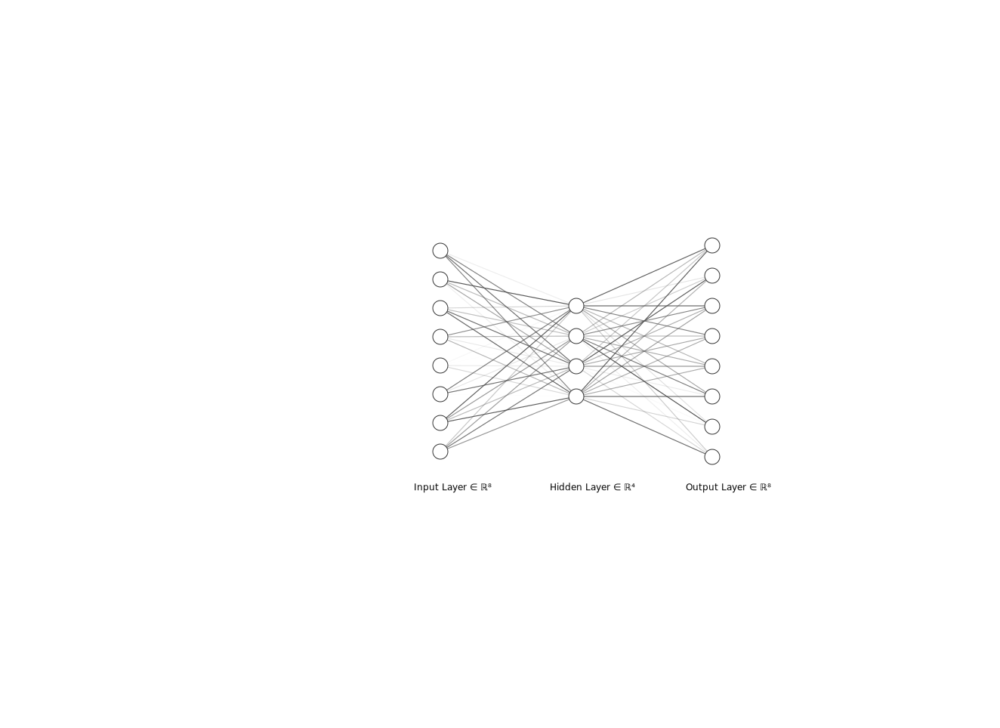

An autoencoder can be thought of in two parts, an encoder and a decoder [1], the encoder takes in the input data $\mathbf{x}_{i}$ and outputs a lower dimensional representation, call this $\mathbf{z}_{i}$. The decoder takes as input $\mathbf{z}_{i}$ and outputs the original input $\mathbf{x}_{i}$.

Putting this all together we have two functions, $f$ and $g$:
$$f(\mathbf{x}) \mapsto \mathbf{z}$$

$$g(\mathbf{x}) \mapsto \mathbf{x}$$

This report is going to discuss some of the modern best practices found in other parts of image data research such as image classification and super-resolution and then apply them to autoencoders.

# Modern Best Practices
## Transfer Learning
With the success of many deep learning models, from 29/38 teams competing in the 2017 ImageNet Competition <sup>[4](#imageNetFootNote)</sup> achieving an accuracy of greater than 95% [4][5] to beating the human world champion in Go [6]. Deep learning models are built and trained daily by leading teams from Google and other companies, creating such accurate models requires extensive research, skills and computing power.

_Transfer learning_ is the use of applying one neural network to a new problem, the hope is that the learned architecture can be applied to a new problem. This technique has been proven efficient, especially in image classification where pretrained ImageNet models are transferred and fine-tuned to new image datasets achieve high accuracy [7]. The main benefits to transfer learning are seen when there is a _lack of data_ or when there is a _lack of computing power_.

In these two situations the developer may look into transfer learning to find predefined weights which can be fine-tuned to be used on a new image dataset. This will reduce overall training time and also reduce the need for a large dataset. The reason this works can be seen in [8], the early layers in a trained neural network identify lines, edges, curves. It is not until deeper in the network when objects from the training set can be recognised. Clearly trained networks can be used on other image datasets, as in all contexts the first few layers will be similar, from this point we can fine-tune the deeper layers to fit the new context.  

From a computing power perspective, it requires less time to train the final few layers and fine-tune earlier layers, from a dataset size perspective, less data is required as the earlier layers have mostly already been done for you avoiding overfitting these layers to your dataset.

### Use in Autoencoders
To use this technique in an autoencoder, a pretrained network can be used as the encoder. Such networks are state-of-the-art in object detection and so the bottleneck in the encoder will have a good representation of the input data.

A decoder architecture can be defined which takes this bottleneck back to input size. To train the autoencoder first the decoder will be trained while the pretrained encoder will be untrainable. This allows the decoder to learn the reverse of the encoder.

Once learning has reached a plateau then a discriminative layer as described in [9], this allows us to retain the information found in the pretrained network (especially in the early layers) but also slightly tweak the weights and biases to fit the autoencoder. To do this, lower learning rates are applied to the early layers in the autoencoder which increase through the network. The decoder keeps a constant learning rate which is higher than the encoder so it can be tweaked quicker to fit the encoder.

<a name="imageNetFootNote">1</a>: The ImageNet Large Scale Visual Recognition Challenge (ILSVRC) is an object detection and image classification competition which has been known to push computer vision research but also allow for comparison of results.

## Feature Loss
Feature loss is a type of loss function used mainly in style transfer and super resolution networks. First defined in [10] as _perceptual loss_, the loss function captures features instead of pixel by pixel loss between the prediction and ground truth images.

_Perceptual loss_ works by using pretrained image classification models and extracting the features in the ground truth vs the prediction. [11] shows us how different layers in convolutional networks extract different features, from shapes to patterns to human faces.

To check how accurately our network is creating these features we can compare the activations in layers of pretrained networks and minimise the difference between these. This will allow us to create a network which focus on creating the features in them and not just a pixel per pixel loss.

### Use in Autoencoders
Although not seen specifically used in autoencoders, the use of featureloss has been seen in U-Net architectures (see [DeOldify](https://github.com/jantic/DeOldify)) for super resolution and style transfer as mentioned before.

One issue found when using an autoencoder for images is that as the images get larger it becomes harder to extract a lot of the information into a smaller bottleneck. The resulting output from the autoencoder is often a blurred image. However when using feature loss the hope is that even if some blur exists we are able to see the features that exist on the image. In some situations this may be more helpful than a full image recreation.

## Pixel Shuffle
Traditional methods of upsampling neural networks used _transposed convolutions_, these act as a reverse to convolutional layers with stride or make pooling layers. Using a convolution with stride or followed by maxpooling is called _downsampling_, the reverse for this performed in transpose layers is called _upsampling_. As can be seen in the illustration created by [12] in [figure 1] is that the upsampling has to fill in a lot of gaps, we are essentially using a small point in an image to create a bigger point in a bigger image.

no_padding_strides_transposed_single-1.png


When kernel sizes are not divisible by the stride we start to see overlap [13], this is where "checkerboard artifacts" come from. As can be seen in [figure 2] and [figure 3] from [13] and [12] respectively.

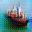


To combat this issue of "checkerboard artifacts", [13] suggests the use of separating upsampling and convolutions, and using a a computation such as nearest-neighbor based resizing followed by a convolution.

_Pixel Shuffle_ is another technique for upsampling and was introduced in [14]. As noticed in [13], it is equivalent to a transposed convolution when ensuring the kernel size can be divided by the stride. This gives an even overlap, reducing checkboard artefacts.

The pixel shuffle algorithm is silghtly more complex and it best described in a image. It works by the follow:

```python
input_image = (H x W x C)
```
Perform convolution to have output:
```python
convolution_output = (H x W x s^2C)
```
Then reshape this to:
```python
pixel_shuffle_output = (sH x sW x C)
```
This can be visualised in [figure 4]
[!figure4](images/46.png "Pixel Shuffle Diagram, taken from [14]")


## Progressive Resizing
_Progressive resizing_ is a technique which has proven effective for GANS [15], Image Super-Resolution [16] and more recently image classification [17] in which the author used progressive resizing as part of their processing to decrease the time taken to train ImageNet to 18 minutes.

Progressive resizing works by first training the network on smaller lower resolution images and slowly increasing the image resolution throughout training. This intuition is to be able to detect objects in images you do not necessarily need high resolution images, this only becomes important for the fewer images where details matter to determine the class.

The main benefit of progressive resizing is the ability to train quicker (and cheaper) for the first few epochs due to the image resolution being smaller, this means a lot less computing power is required to find those first initial relationships.

### Use in autoencoders
To my knowledge there has not been any results or research done into the use of progressive resizing, and in autoencoders it will work slightly differently.

Progressive resizing works well for many networks like Resnet as it is fairly simple to downsample different sized images, especially through the use of stride in convolutional layers. The reason for this is if a smaller image is put into a network built for a larger network then the smaller resolution image would need less downsampling than the larger. However if we have an image such as:

```python
Image(in, 1, 1)
```

applying a convolutional layer with stride 2 will give us:

```python
Image(out, 1, 1)
```
and so the network is still able to work with this new size.

In autoencoders this is slightly different as we attempt to reverse the downsampling step. Due to different images requiring different amounts of downsampling the same applies to upsampling. However using an upsampling technique whether it is _interpolation_ or a _transposed convolution_, we need to specify an upsampling amount. This will always be applied no matter the image size.

Therefore to use this in autoencoders we either need to train two versions of the network. The first is for the lower resolution images, and the second is then for the higher resolution images. For each increase in resolution we just need to insert a new upsampling layer. This should be fine as we can train the network and then just add a head on top. This means we can use our initial training and the weights on the last layer can be learned independently and then fine-tuned with the rest of the network.

# Experiment
All experiments were run on [Google Colab](https://colab.research.google.com/notebooks/welcome.ipynb) using an assigned GPU at that time, this could mean some models may have used a better GPU than other models, however this will only have an effect on time taken and not the outputs.

Due to using a free online GPU provided by Google, amount of training is minimal (while still providing good results) as to not take advantage or exploit this product.

This data used for this experiment are the MNIST dataset [18] and the Cifar10 dataset [19]

## Models

A total of 6 models will be trained and analysed. The _baseline model_ using mean squared error (MSE) loss, the _pixel shuffle model_ using MSE loss, the baseline model using _progressive resizing_ and MSE loss, the _pretrained model_ both _with_ and _without_ pretrained weights (called Pretrained and Resnet from now on) with an MSE loss and finally the baseline model using a _Feature Loss_ calculated from the VGG16 model.

## Measures
Three measures of accuracy will be used to compare models. Mean squared error, mean absolute error and _classification accuracy_.

To calculate classification accuracy, an image classifier is trained on the original images, then the autoencoded images are ran through to see if the model will still the predict the same. This means that if the encoded and decoded image holds enough information from the original image a similar classification accuracy will be seen. This will mean that recreation of the image is not just important but also content of the image.

Comparing both MAE and MSE can allow us to see which models have more anomalous outputs (which will be represented in the MSE).

## Results
All results are based on the testing data supplied by the datasets, and so this data has been unseen by the model in training. Each model was trained for a total of 15 epochs.

Optimal learning rates for each model were found through calculating the loss with different learning rates for a batch from the dataset. This means that different models require different learning rates. Using the same learning rate for all would not be a fair assessment due to some models have more parameters to learn.
### MNIST
| Method        | MAE           | MSE   | Classifier Accuracy | Training Time |
| :-----------: |:-------------:| :----:|:-------------------:| :--------:|
| Original Image | n/a | n/a | 0.9912 | n/a |
| Baseline      | ........ | **0.000854** | **0.9900** | 24m 43s |
| Pixel Shuffle | 0.011906 | 0.001174 | 0.9870 | 27m 40s |
| Progressive Resizing | 0.011891 | 0.001168 | 0.9877 | 24m 44s |
| Pretraining | 0.018001 | 0.003003 | 0.9804 | 25m 12s |
| Resnet w/o pretrain | 0.018034 | 0.003589 | 0.9654 | 25m 30s |
| Feature Loss | 0.075097 | 0.011058 | 0.9886 | 26m 52s |

### Cifar10
| Method        | MAE           | MSE   | Classifier Accuracy | Training Time |
| :-----------: |:-------------:| :----:|:-------------------:| :--------:|
| Original Image | n/a | n/a | 0.8179 | n/a |
| Baseline      | 0.046274 | 0.004345 | 0.4558 | 23m 47s |
| Pixel Shuffle | 0.046642 | 0.004385 | 0.4759 | 27m 6s |
| Progressive Resizing | **0.046132** | 0.004310 | 0.4608 | 23m 5s |
| Pretraining | 0.076558 | 0.011385 | 0.2333 | 24m 12s |
| Resnet w/o pretrain | 0.075097 | 0.011058 | 0.2236 | 26m 6s |
| Feature Loss | 0.046206 | **0.004301** | **0.6209** | 28m 34s |

The best model for the MNIST dataset was the _baseline_ model for all three measurements. For the Cifar-10 dataset, the best model for MSE and Classifier Accuracy was the _Feature Loss_ model, however the _Pixel Shuffle_ model achieved the lowest MAE. Overall making the Feature Loss model the best for Cifar-10.

## Discussion
The first thing to note that due to the _simplicity_ of the MNIST images, it appears that any of the new training techniques becomes overkill for the MNIST images and the baseline (most simple) model works best for this dataset. Due to this it is hard to do a comparison of the techniques apart from saying that for simple images only a simple model is required.

The conclusion from the MNIST dataset is however that images of size 3x32x32=3072 (the input size) can be cut down to an array of size 1000, meaning these images can be stored at 1/3rd of the size and still achieve a similar accuracy on a classifier (0.9912 compared to 0.9900). However an issue with this is that the original images are of size 1x32x32 and are extended to 3x32x32 to make the models comparable between both datasets. This means the images are not compressed as much as it seems if you take the size of the original images (1024 pixels).

When looking at the Cifar-10 results, it can be seen the more complex methods become more beneficial for more complex images. However, the results are still far from perfect. The best measure to see the "usability" of the model is the classifier accuracy as this shows how the images can still be recognised. Looking at this assessment Feature Loss was the best technique which shows when using an autoencoder trying to recreate features is better than trying to recreate each individual pixel.

The downside to using the Feature Loss model is the time it takes to train, taking over 5 minutes longer than the shortest training time for Cifar-10. However, when compared to other methods it shows the extra training is worth it as the next highest classifier accuracy is as low as 0.4759.

The next subsections will show testing set images for each model and discuss what was learned from using each technique. Each image has the input on the left and the model output on the right.

### Baseline
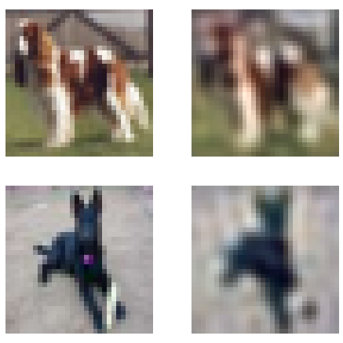
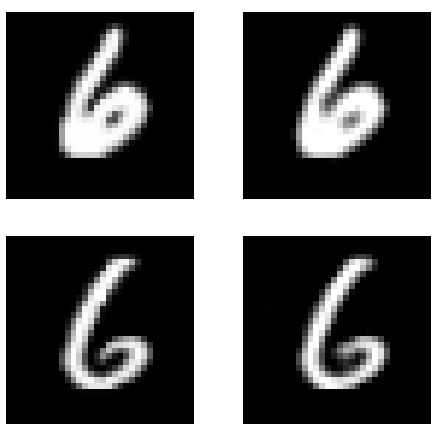
The baseline images for Cifar10 are too blurred and unusable as an autoencoder.
### Feature Loss
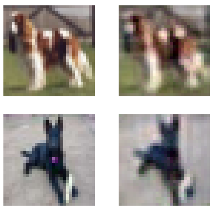
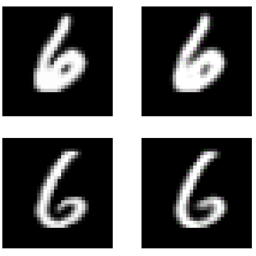

When training the Feature Loss model the VGG16 model was used. What was found was that the best way to weight features was to compare with earlier parts of the model and slowly decrease the weighting. This suggests that for autoencoders the most important features are found in the earlier layers, as mentioned before this is due to the first few parts to image classifiers being edge detectors. Detecting these basic features allows shapes of objects to be recreated with less blur than when performing pixel to pixel loss functions.

This is compared to using the middle layers in models such as [DeOldify](https://github.com/jantic/DeOldify) which are looking for more complex features such as fur on animals.

Using the middle to last layers in the autoencoders proved to not be effective and looked to _force_ features into the image which were not actually in the image. Perhaps more work could be done into this to make it work effectively.

### Pretraining
#### Pretrained Weights
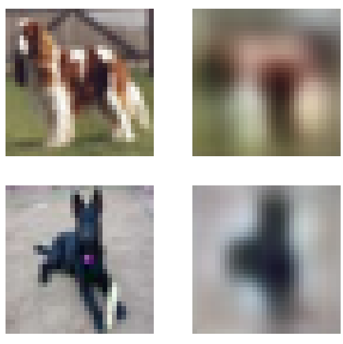
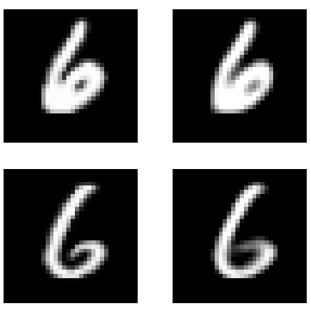
Pretrained weights proved to be ineffective when creating an autoencoder, this is due to the complexity of the encoder (resnet). The initial idea was that a model used to identify objects and classify images would be effective as it would be able to recreate features in the image.

The resulting images do appear to separate objects from the background, however both the object and background are a blur and so it is unusable. However this could still mean the encoder is effective for other use cases such as unsupervised learning. The output of the encoder from this autoencoder could be  clustered on to see if images are able to split into classes.

#### Resnet Model


Similarly with the resnet encoder (without using the pretrained weights), similar results are found suggesting this encoder is just too complex when trying to create an autoencoder.

Again, like above the encoder could be looked into more.

### Pixel Shuffle
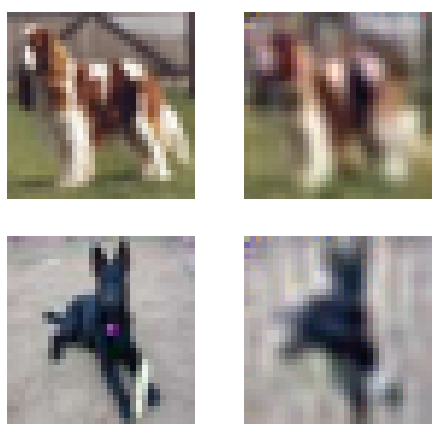
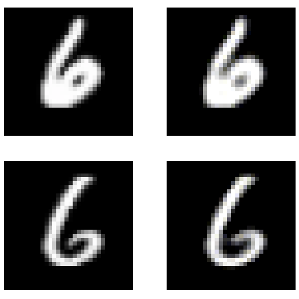

Pixel shuffle achieves better results in certain situations when measuring with MSE. When looking for visually pleasing images, it achieves similar to the upsampling technique except contains "defects" instead of blur. Overall this gives a less visually pleasing result. Features in the image are slightly more easy to see when compared to the baseline however overall it is still unusable.

### Progressive Resizing
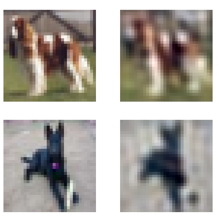
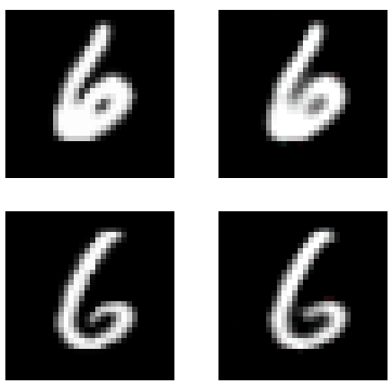

Progressive resizing was effective in reducing training time while also achieving similar results to the baseline model, which suggests this is an effective technique to reduce overall training time.

What is not covered here is the generalisation of the models to differing image sizes, using progressive resizing could force the model to learn more general weights which work for all image sizes, whereas for all the other models the training data was only 32 by 32 images which may not work on other sizes.

# Conclusion
Overall when attempting to use an autoencoder as a compression system, visual pleasing results are difficult to achieve with images. However this report has shown that achieving the best results in being able to classify an image after encoding and decoding it that pixel to pixel loss is not the best and in fact training the model to try and recreate features in the image is more important.

One drawback to this report is the lack of resources to really train these models and 15 epochs was the max for each model. Perhaps after 100 epochs we could start to see even larger differences and notice the effect of each individual technique more.

One aspect of an autoencoder that was not mentioned here was the information held in the encoder. In many situations the encoded format is the most important part and so it is best to optimise this instead of the overall output from the autoencoder.

## Further Research
Below I list some topics which could be looked into further to see the effects.
- Combinations of techniques used here (ie featureloss + pixel shuffle etc)
- Does progressive resizing lead to a more general results for different image sizes
- Use of similar models on larger images such as those from ImageNet


# References
[1] Ian Goodfellow, Yoshua Bengio and Aaron Courville. _Deep Learning_. MIT Press, 2016. http://www.deeplearningbook.org

[2] Chong Zhou and Randy C. Paffenroth. _Anomaly Detection with Robust Deep Autoencoders_. 2017. Proceedings of the 23rd ACM SIGKDD International Conference on Knowledge Discovery and Data Mining, pp. 665-674. DOI: 10.1145/3097983.3098052.

[3] Dumitru Erhan, Yoshua Bengio, Aaron Courville, Pierre-Antoine Manzagol, Pascal Vincent and Samy Bengio. _Why Does Unsupervised Pre-training Help Deep Learning?_. Journal of Machine Learning Research 11 (2010), pp. 625-660.

[4] Olga Russakovsky*, Jia Deng*, Hao Su, Jonathan Krause, Sanjeev Satheesh, Sean Ma, Zhiheng Huang, Andrej Karpathy, Aditya Khosla, Michael Bernstein, Alexander C. Berg and Li Fei-Fei. (* = equal contribution). _ImageNet Large Scale Visual Recognition Challenge_. IJCV. 2015.

[5] Dave Gershgorn. _The Quartz guide to artificial intelligence: What is it, why is it important, and should we be afraid?_. Quartz, 2017. Retrieved April 2020.

[6] David Silver1*, Aja Huang1*, Chris J. Maddison1, Arthur Guez1, Laurent Sifre1, George van den Driessche1, Julian Schrittwieser1, Ioannis Antonoglou1, Veda Panneershelvam1, Marc Lanctot1, Sander Dieleman1, Dominik Grewe1, John Nham2, Nal Kalchbrenner1, Ilya Sutskever2, Timothy Lillicrap1, Madeleine Leach1, Koray Kavukcuoglu1, Thore Graepel1 and Demis Hassabis1. (* = equal contribution). _Mastering the game of Go with deep neural networks and tree search_. Nature, 2016. __529__(7587), pp. 484–489.

[7] Simon Kornblith, Jonathon Shlens and Quoc V. Le. _Do Better ImageNet Models Transfer Better?_. arXiv, 2019. arXiv:1805.08974.

[8] Olah, et al.,. _Feature Visualization_. Distill, 2017.

[9] Jeremy Howard, Sebastian Ruder. _Universal Language Model Fine-tuning for Text Classification_. arXiv, 2018. arXiv:1801.06146.

[10] Justin Johnson, Alexandre Alahi and Li Fei-Fei. _Perceptual Losses for Real-Time Style Transfer and Super-Resolution_. arXiv, 2016. arXiv:1603.08155

[11] Zeiler, Matthew & Fergus, Rob. _Visualizing and Understanding Convolutional Neural Networks_. ECCV 2014, Part I, LNCS 8689. 8689. 10.1007/978-3-319-10590-1_53.

[12] Vincent Dumoulin and Francesco Visin. _A guide to convolution arithmetic for deep learning_. arXiv, 2016. arXiv:1603.07285.

[13] Augustus Odena, Vincent Dumoulin and Chris Olah. _Deconvolution and Checkerboard Artifacts_. Distill, 2016. http://distill.pub/2016/deconv-checkerboard

[14] Wenzhe Shi, Jose Caballero, Ferenc Huszár, Johannes Totz, Andrew P. Aitken, Rob Bishop, Daniel Rueckert and Zehan Wang _Real-time single image and video super-resolution using an efficient sub-pixel convolutional neural network_. 2016. Proceedings of the IEEE Conference on Computer Vision and Pattern Recognition, pp. 1874—1883. DOI: 10.1109/cvpr.2016.207

[15] Tero Karras, Timo Aila, Samuli Laine, Jaakko Lehtinen. _Progressive Growing of GANs for Improved Quality, Stability, and Variation_. arXiv, 2018. arXiv:1710.10196.

[16] Bee Lim, Sanghyun Son, Heewon Kim, Seungjun Nah, Kyoung Mu Lee. _Enhanced Deep Residual Networks for Single Image Super-Resolution_. arXiv, 2017. arXiv:1707.02921.

[17] Jeremy Howard. _Training Imagenet in 3 hours for $25; and CIFAR10 for $0.26_. 2018. https://www.fast.ai/2018/04/30/dawnbench-fastai/.

[18] http://yann.lecun.com/exdb/mnist/

[19] Alex Krizhevsky. _Learning Multiple Layers of Features from Tiny Images_. 2009. https://www.cs.toronto.edu/~kriz/cifar.html
